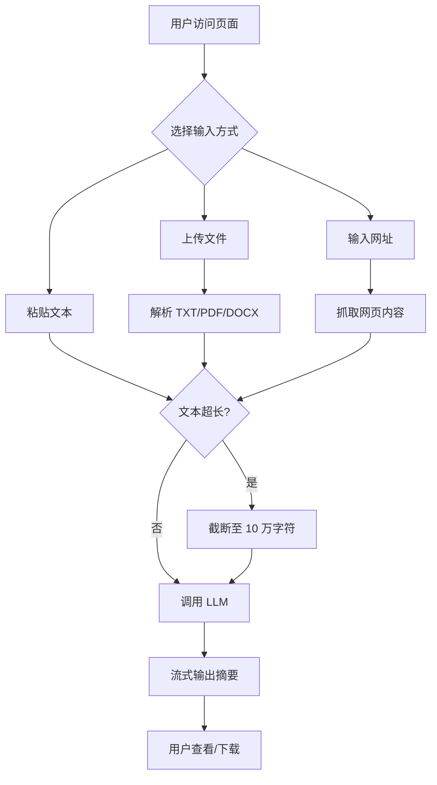

# PRD: 智能文档摘要工具

## 1. 项目背景
阅读长文档耗时费力，不同文档类型需要不同的摘要结构。当前缺少一个**多厂商、多格式、开箱即用**的在线摘要工具。用户不需要安装任何软件，打开浏览器即可使用。

## 2. 用户画像
| 用户类型 | 场景 | 核心需求 |
|---------|------|---------|
| 学生/研究生 | 阅读论文、教材、文献 | 快速获取论文核心结论、研究方法 |
| 职场人士 | 处理会议记录、技术文档、报告 | 提取关键决策、待办事项 |
| 普通用户 | 阅读长网页、小说、新闻 | 了解文章大意，决定是否精读 |

## 3. 功能列表

| 功能 | 描述 | 优先级 |
|------|------|--------|
| 文本粘贴 | 直接粘贴文本生成摘要 | P0 |
| 文件上传 | 上传 TXT/PDF/DOCX 生成摘要 | P0 |
| URL 抓取 | 输入网址抓取内容并摘要 | P0 |
| 多厂商切换 | 支持6+ AI 厂商自由切换 | P1 |
| 深度思考模式 | 智谱/DeepSeek 推理模型支持 | P1 |
| 自适应摘要结构 | AI 自动识别文档类型选用合适模板 | P0 |
| 流式输出 | 逐 token 显示摘要生成过程 | P1 |
| 结果下载 | 支持 Markdown/TXT 导出 | P1 |
| 摘要历史 | 保存历史摘要记录 | P2 |
| 多文档对比 | 对比多个文档摘要 | P3 |

## 4. MVP 范围

```
用户打开页面 → 粘贴/上传/输入文档 → AI 识别类型 → 流式输出摘要 → 下载结果
```

**MVP 要做：** 文本粘贴、文件上传、URL 抓取、自适应摘要、流式输出、下载  
**MVP 不做：** 摘要历史、多文档对比、用户系统

## 5. 业务流程图



## 6. 技术约束
- 单文件上传上限：50MB
- 最大处理文本：100,000 字符
- LLM 超时：动态计算（30s ~ 130s），失败自动重试 1 次
- 部署平台：Streamlit Cloud（无服务端存储）
- 不存储用户文档，所有数据在 Session 中临时保留
