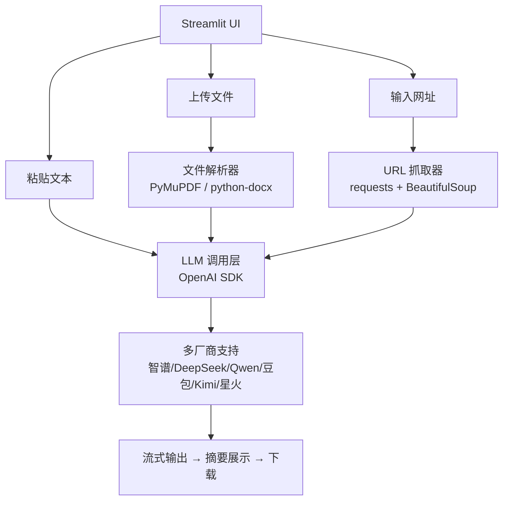

# 📄 智能文档摘要工具

## 一句话描述
支持多种 AI 厂商的多格式文档摘要工具，粘贴文本 / 上传文件 / 输入网址即可生成结构化摘要。

## 要解决什么问题
- 阅读长文档耗时，需要快速获取核心内容
- 不同文档类型（论文/技术文档/会议记录等）需要不同的摘要结构
- 不想局限于单一 AI 厂商，需要灵活切换

## 目标用户
- 需要快速理解长文档的任何用户
- 学生、研究人员、职场人士

## MVP 范围
选择厂商/模型 → 输入文本/文件/URL → AI 自动识别类型 → 生成结构化摘要 → 下载结果

## 技术方案
- **Web 框架**：Streamlit（快速构建 AI 应用，一键部署）
- **API 接入**：OpenAI Python SDK（兼容多厂商统一接口）
- **文档解析**：PyMuPDF + python-docx + BeautifulSoup

## 功能特性

- **多格式输入**：支持 TXT / PDF / DOCX 文件上传、文本粘贴、URL 抓取
- **多厂商支持**：智谱AI / DeepSeek / 阿里千问 / 字节豆包 / Kimi / 讯飞星火
- **深度思考**：支持智谱、DeepSeek 等模型的深度推理模式
- **自适应摘要**：AI 自动识别文档类型，选用最合适的摘要结构
- **流式输出**：实时显示摘要生成过程
- **结果导出**：支持 Markdown / TXT 格式下载

## 架构图



## 本地运行

```bash
# 1. 安装依赖
pip install -r requirements.txt
pip install -r requirements-dev.txt  # 测试依赖（可选）

# 2. 创建环境变量文件 .env
ZHIPUAI_API_KEY=your_api_key_here

# 3. 启动
streamlit run app.py
```

## 部署到 Streamlit Cloud

1. 将代码推送到 GitHub
2. 在 [Streamlit Cloud](https://streamlit.io/cloud) 创建新应用
3. 在 Dashboard → **Settings** → **Secrets** 中设置：
   ```toml
   ZHIPUAI_API_KEY = "your_api_key_here"
   ```
4. 部署后访问生成的公网链接

## 项目结构

```
智能文档摘要工具/
├── app.py              # Streamlit UI 主程序
├── consts.py           # 厂商配置 + Prompt 模板
├── utils.py            # 工具函数（文件/URL/LLM调用）
├── tests/              # 测试套件
│   ├── test_utils.py
│   └── test_llm.py
├── requirements.txt    # 运行时依赖
├── requirements-dev.txt# 测试依赖
├── .env                # 本地开发环境变量（不上传）
├── .gitignore          # Git 忽略规则
├── PRD.md              # 产品需求文档
├── 产品开发全流程指南.md # 开发流程参考
├── .streamlit/
│   └── secrets.toml    # 部署用模板
└── readme.md
```

## 支持的厂商及接入地址

| 厂商 | API 地址 | 深度思考 |
|---|---|---|
| 智谱AI | `https://open.bigmodel.cn/api/paas/v4/` | ✅ |
| DeepSeek | `https://api.deepseek.com` | ✅ |
| 阿里千问 | `https://dashscope.aliyuncs.com/compatible-mode/v1` | ❌ |
| 字节豆包 | `https://ark.cn-beijing.volces.com/api/v3/` | ❌ |
| Kimi | `https://api.moonshot.cn/v1` | ❌ |
| 讯飞星火 | `https://spark-api-open.xf-yun.com/v1` | ❌ |
