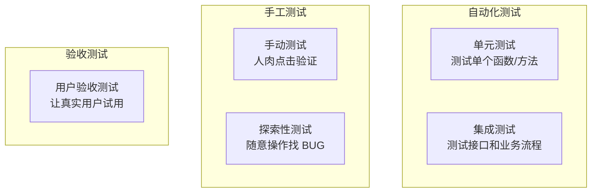

# 产品开发全流程指南（通用模板）

> 每新开一个项目，**复制本文档到新项目根目录**，然后把文中所有 **📌 案例** 内容替换成你的项目实际情况。
>
> 本文是"流程指引"，不是"教科书"——告诉你每个阶段要做什么、产出什么、怎么避坑，但具体内容需要你自己填。

---

## 📋 如何使用本文档

| 步骤 | 操作 |
|------|------|
| ① | 把 `产品开发全流程指南.md` 复制到新项目根目录 |
| ② | 从 **§三 需求阶段** 开始，按顺序过每个阶段 |
| ③ | 每个阶段里有 **📌 案例** 标记的内容，替换为你的项目内容 |
| ④ | 每个阶段末尾的 **产出物** 打了 `[ ]`，做完一项勾一项 |
| ⑤ | **§九 验收标准** 帮你判断"这阶段可以结束了没" |

**一句话：先读通用原则 → 参考案例 → 替换成自己的 → 打勾完成。**

---

## 📄 项目启动一页纸

拿到一个新项目，**第一步不是写代码，不是画原型，而是先写一页纸。**

这一页纸是整个项目的"导航图"——用不到一屏的篇幅把项目浓缩清楚。任何人（面试官、队友、未来的你）打开项目，30 秒就能知道"这项目在干嘛"。

### 一页纸模板

```
# 📄 [项目名称]

## 一句话描述
[50 字以内说清这个项目是干什么的]

## 要解决什么问题
- [痛点 1]
- [痛点 2]

## 目标用户
- [用户角色 1]：[他们的核心需求]
- [用户角色 2]：[他们的核心需求]

## MVP 范围
[用箭头连出用户从开始到结束的完整路径]
[例：注册登录 → 创建项目 → 邀请成员 → 完成任务 → 查看报告]

## 技术方案
- [技术 1]：[选它的理由]
- [技术 2]：[选它的理由]

## 关键里程碑
- [时间]：[做什么]
- [时间]：[做什么]

## 成功指标
- [量化目标 1]
- [量化目标 2]
```

> 📌 案例（图书管理系统的一页纸）：
>
> ```
> # 📄 校园图书管理系统
>
> ## 一句话描述
> 让校内同学在线查书、借书、还书，不用跑图书馆白跑一趟。
>
> ## 要解决什么问题
> - 同学跑到图书馆发现书被借走了，白跑
> - 管理员每天手工登记借还，耗时费力
> - 借书记录全靠记忆，经常逾期
>
> ## 目标用户
> - 在校学生（核心）：需要借书、查书
> - 图书管理员：需要管理馆藏、查看借阅情况
>
> ## MVP 范围
> 用户注册登录 → 浏览图书列表 + 搜索 → 借书 / 还书 → 查看借阅记录
>
> ## 技术方案
> - 前端：Vue 3 + Element Plus
> - 后端：Spring Boot + MyBatis
> - 数据库：MySQL
> - 认证：JWT Token
>
> ## 关键里程碑
> - Week 1-2：需求 + PRD
> - Week 3-4：开发（认证 + 图书 CRUD）
> - Week 5：开发（借阅 + 权限）
> - Week 6：测试 + 修复
> - Week 7：上线
>
> ## 成功指标
> - 覆盖 50+ 校内用户
> - 借书操作 ≤ 3 步
> - 核心功能无 BUG
> ```

**写完这一页，再进入下面的流程。** 这页纸能在后面的每个阶段帮你做决策——"这个功能要不要做？看一页纸上的 MVP 范围"。

---

## 🚀 快速检查清单

这页是给老手速查用的。新手可以跳过，从 §一 开始细读。

```
□ 阶段一：需求
  □ 访谈了 ≥5 个目标用户
  □ 输出了需求清单（P0/P1/P2/P3）
  □ 完成了竞品分析（≥3 款竞品）

□ 阶段二：产品
  □ 写完了 PRD（含背景、用户画像、功能列表、流程图、验收标准）
  □ 画了核心业务流程图
  □ 圈定了 MVP 范围

□ 阶段三：设计
  □ 技术选型完成且有依据
  □ 数据库设计完成（ER 图 + DDL）
  □ API 接口文档完成

□ 阶段四：开发
  □ 代码已提交到 Git
  □ 前后端/模块间已完成联调
  □ README 写了如何启动

□ 阶段五：测试
  □ 核心路径有自动化测试
  □ 边界情况已覆盖
  □ BUG 已记录并修复

□ 阶段六：上线
  □ 已部署到目标环境
  □ 生产配置已检查（密码、密钥、日志）
  □ 收集了第一批用户反馈
```

---

## 一、核心认知：先破除三个误区

### 误区 1：项目 = 写代码

**事实：写代码只占整个项目周期的 25%-35%。** 剩下 65%-75% 的时间花在：
- 搞清楚"做什么"（需求）
- 设计好"怎么做"（方案）
- 验证"做对了没"（测试）
- 上线后"持续改进"（运营）

> 📌 案例：本文配套的图书管理系统项目，需求+产品+设计阶段占了约一半时间，但这些阶段的产出（PRD、API.md、DATABASE.md）直接决定了代码写得多顺。

### 误区 2：学生项目就是"从技术出发"

**事实：商业项目永远"从问题出发"。** 技术只是工具，核心是"解决什么人的什么问题"。

> 📌 案例：图书管理系统不是"为了用 Spring Boot 而做"，核心是解决"同学借书跑空、管理员手工登记累"这两个真问题。

### 误区 3：文档是写给老师看的

**事实：文档是写给未来的自己看的。** 3 个月后你回头改代码，如果没有文档，你连自己当时为什么这么设计都忘了。

> 📌 案例：这个项目的 DATABASE.md 里记了 borrow_record 为什么保留历史记录而不是只存最新状态——这个决策依据如果不写下来，3 个月后你自己也想不起来。

---

## 二、项目全生命周期（6 个阶段）

```
┌──────────┐   ┌──────────┐   ┌──────────┐   ┌──────────┐   ┌──────────┐   ┌──────────┐
│ 需求阶段  │ → │ 产品阶段  │ → │ 设计阶段  │ → │ 开发阶段  │ → │ 测试阶段  │ → │ 上线阶段  │
│ (搞清楚   │   │ (画清楚   │   │ (写清楚   │   │ (编清楚   │   │ (验清楚   │   │ (推出去   │
│  做什么)  │   │  长啥样)  │   │  怎么做)  │   │  代码)    │   │  做对了)  │   │  用)      │
└──────────┘   └──────────┘   └──────────┘   └──────────┘   └──────────┘   └──────────┘
```

**按工时估算：**

| 阶段 | 占比 | 核心问题 |
|------|------|---------|
| 需求 | 15-20% | 解决谁的什么问题？ |
| 产品 | 15-25% | 做成什么样？先做什么？ |
| 设计 | 10-15% | 怎么实现？用什么技术？ |
| 开发 | 25-35% | 能不能跑起来？ |
| 测试 | 10-15% | 有没有做对？有没有漏洞？ |
| 上线 | 5-10% | 怎么让别人用上？ |

> 📌 案例（图书管理系统各阶段实际内容）：
> - 需求：访谈同学发现借书跑空、管理员登记累、逾期不知道
> - 产品：PRD.md 确定 MVP → 只做登录、图书 CRUD、借书还书
> - 设计：Spring Boot + Vue3 + MySQL + JWT
> - 开发：前后端各 5 个步骤，15 天左右
> - 测试：15 个集成测试覆盖核心链路
> - 上线：待部署到云服务器

---

## 三、阶段一：需求阶段（搞清楚"做什么"）

### 3.1 目标

回答三个问题：
1. **为谁做？**（目标用户是谁）
2. **解决什么问题？**（用户现在的痛点是什么）
3. **凭什么用你？**（和现有方案比，你的差异在哪）

### 3.2 要做的事

#### ① 用户访谈

| 事项 | 通用指导 | 📌 案例（图书管理系统） |
|------|---------|------------------------|
| 找谁聊？ | 目标用户群体中的真实用户 | 高校同学、图书管理员 |
| 聊什么？ | 现在的做法、遇到的麻烦、最想要的一个功能 | 现在怎么借书的？遇到过什么问题？ |
| 聊几个？ | 5-10 个就能覆盖 80% 的痛点 | 4 位（大三学生、研二学生、管理员、学生会） |
| 怎么记？ | 录音（征得同意）或当面笔记，事后整理 | 整理成用户-痛点-频次表格 |

**访谈记录模板（填你的）：**

| 用户/角色 | 现在的做法 | 遇到什么麻烦 | 最想要什么 | 频次 |
|-----------|-----------|-------------|-----------|------|
| [用户 A] | [描述] | [痛点] | [需求] | [每天/每周/偶尔] |
| [用户 B] | [描述] | [痛点] | [需求] | [每天/每周/偶尔] |
| [用户 C] | [描述] | [痛点] | [需求] | [每天/每周/偶尔] |

> 📌 案例（图书管理系统的访谈发现）：
>
> | 用户 | 痛点 | 频次 |
> |------|------|------|
> | 大三学生 A | 跑去图书馆发现书被借走了，白跑一趟 | 每周 1-2 次 |
> | 研二学生 B | 不记得还书日期，经常逾期 | 每月 1 次 |
> | 图书管理员 C | 每天手动登记借还，耗时 1h+ | 工作日每天 |
> | 学生会 D | 想查某个类型的书有多少本，没地方看 | 偶尔 |

#### ② 竞品分析

列出同类产品，逐一对比。**对比维度示例**（根据你的项目类型调整）：

| 维度 | 你的产品 | [竞品 A] | [竞品 B] | [竞品 C] |
|------|---------|---------|---------|---------|
| [维度 1：如使用门槛] | [你的值] | [竞品 A 的值] | [竞品 B 的值] | [竞品 C 的值] |
| [维度 2] | [你的值] | [竞品 A 的值] | [竞品 B 的值] | [竞品 C 的值] |
| [维度 3] | [你的值] | [竞品 A 的值] | [竞品 B 的值] | [竞品 C 的值] |

> 📌 案例（图书管理系统竞品对比）：
>
> | 维度 | 你的产品 | 传统图书馆系统 | 纸质登记 |
> |------|---------|--------------|---------|
> | 使用门槛 | 浏览器打开即用 | 需安装客户端 | 无门槛 |
> | 图书搜索 | 支持模糊搜索 | 有搜索功能 | 不支援 |
> | 自助借还 | 用户自助操作 | 管理员代操作 | 管理员手工登记 |
> | 数据统计 | 无（V2 规划） | 有报表功能 | 无 |

**竞品来源：** 搜索引擎搜"XX 管理系统"、应用商店搜同类 APP、问同学他们在用什么、GitHub 搜同类开源项目。

#### ③ 需求整理

把访谈和竞品分析的结果，整理成**需求清单**：

**需求清单模板（填你的）：**

| 需求 | 用户反馈来源 | 优先级 | 备注 |
|------|-------------|--------|------|
| [需求 1] | [用户 A、用户 B] | P0 | [为什么是 P0] |
| [需求 2] | [用户 C] | P1 | [为什么是 P1] |
| [需求 3] | [竞品分析发现的] | P2 | [以后再做] |
| [需求 4] | — | P3 | [这期不做] |

**优先级定义（MoSCoW 法）：**

| 级别 | 含义 | 判断标准 |
|------|------|---------|
| **P0 (Must)** | 不做这个功能，产品根本没法用 | 核心闭环缺失 |
| **P1 (Should)** | 重要，但没有也可以先上线 | 提升体验，非核心 |
| **P2 (Could)** | 锦上添花 | 有最好，没有也行 |
| **P3 (Won't)** | 这期不做，以后再说 | 很酷但不急 |

> 📌 案例（图书管理系统需求清单）：
>
> | 需求 | 用户反馈来源 | 优先级 |
> |------|-------------|--------|
> | 在线查看图书可借状态 | 同学 A，B | P0 |
> | 自助借书还书 | 管理员 C | P0 |
> | 按书名搜索 | 同学 A，D | P1 |
> | 逾期提醒 | 同学 B | P2 |
> | 数据统计 | 管理员 C，学生会 D | P3 |

### 3.3 产出物

- [ ] 需求调研报告（`.md`）：含访谈记录、痛点总结、需求清单
- [ ] 竞品分析报告（`.md`）：含竞品对比表、差异化定位

### 3.4 常用工具

| 用途 | 推荐工具 |
|------|---------|
| 访谈记录 | 腾讯文档 / Notion / Obsidian / 纸笔 |
| 竞品分析 | Excel / 在线表格 / 思维导图 |
| 需求管理 | 飞书多维表格 / Excel / GitHub Projects |

### 3.5 常见坑

- ❌ **只听一个人的需求就开干** → 至少访谈 5 个人，交叉验证
- ❌ **自己猜用户需要什么** → 必须真的去问，你猜的不算
- ❌ **需求太多想全做** → 只选 P0 先做，其他的往后排
- ❌ **只做用户访谈不做竞品分析** → 你可能在做一个别人已经做过的功能

---

## 四、阶段二：产品阶段（画清楚"长啥样"）

### 4.1 目标

把需求翻译成**具体功能**和**操作流程**，让开发看到就知道"要做什么界面、什么逻辑"。

### 4.2 要做的事

#### ① 写 PRD（产品需求文档）

**PRD 是产品经理最核心的产出。** 它回答"我们到底在做什么"。

**PRD 结构模板：**

| 章节 | 内容 | 回答的问题 |
|------|------|-----------|
| 项目背景 | 为什么做这个产品 | "为什么要做" |
| 用户画像 | 典型用户是谁、他们的特征 | "给谁做的" |
| 功能列表 | 所有功能及描述 | "有哪些功能" |
| 业务流程图 | 用户怎么操作、系统怎么响应 | "流程是怎样的" |
| 产品架构图 | 前后端/模块如何分工 | "整体怎么搭" |
| 功能优先级 | 先做什么、后做什么 | "先做哪个" |
| 验收标准 | 做成什么样算"完成了" | "怎么才算做好" |

> 📌 案例：本项目中 `PRD.md` 即是按此结构写的完整 PRD，可直接作为参考。

#### ② 画业务流程图

流程图是 PRD 的灵魂。三种核心图：

| 图的类型 | 说明 | 推荐工具 |
|----------|------|---------|
| 业务流程图 | 用户操作 + 系统处理的全过程 | Mermaid / ProcessOn / draw.io |
| 状态图 | 数据状态流转（如：待支付 → 已支付 → 已发货） | Mermaid / PlantUML |
| 功能结构图 | 系统有哪些模块、子功能 | Mermaid mindmap / XMind |

> 📌 案例（图书管理系统业务流程图 — 借书）：
>
> ```mermaid
> flowchart TD
>     A[用户进入图书列表] --> B[浏览图书状态]
>     B --> C{状态是否为 available?}
>     C -->|否| D[已借出，不可操作]
>     C -->|是| E[点击借书]
>     E --> F[后端校验]
>     F --> G[插入借阅记录 + 更新图书状态]
>     G --> H[借阅成功]
> ```

#### ③ 圈定 MVP 方案

MVP = Minimum Viable Product，最小可行产品。

**原则：** 只做核心闭环，砍掉一切"锦上添花"。

**判断方法：** 从用户的第一次操作到目标达成，画一条最短路径，路径上的功能就是 MVP，路径外的就是以后再做。

> 📌 案例（图书管理系统 MVP）：
> - **MVP 要做：** 用户登录 → 看到图书 → 借书 → 还书 → 看到自己的记录
> - **不是 MVP：** 深色主题、封面图片、逾期邮件提醒、数据统计

#### ④ 画原型图（可选但强烈推荐）

原型图就是"界面的草图"，不用有颜色、不用像素级精确，黑白线框图就够。

| 工具 | 难度 | 适用场景 |
|------|------|---------|
| 纸笔 | 零门槛 | 快速方案迭代 |
| Excalidraw | 极低 | 手绘风格，免费在线 |
| Figma | 中等 | 专业协作工具 |
| 墨刀 | 中等 | 国产，移动端原型 |
| Axure | 较高 | 复杂交互原型 |

> 对于学生项目，**纸笔或 Excalidraw 完全够用。**

### 4.3 产出物

- [ ] PRD（`.md` 文件，含背景、用户画像、功能列表、流程图、验收标准）
- [ ] 业务流程图（嵌入 PRD，至少覆盖核心路径）
- [ ] 功能结构图（嵌入 PRD，Mermaid mindmap）
- [ ] 产品架构图（嵌入 PRD，Mermaid flowchart）
- [ ] 原型图（可选，Excalidraw / 纸笔 / Figma）

### 4.4 常用工具

| 用途 | 推荐工具 |
|------|---------|
| 写 PRD | VS Code + Markdown / Notion / 飞书文档 |
| 画流程图 | Mermaid（推荐，代码化）、ProcessOn、draw.io |
| 画原型 | Excalidraw、Figma、墨刀、纸笔 |
| 画脑图 | XMind、Mermaid mindmap、ProcessOn |

### 4.5 常见坑

- ❌ **PRD 写得太细**（"登录按钮距离顶部 20px"）→ 那是原型干的事，PRD 写逻辑
- ❌ **PRD 写得太粗**（"做个借书功能"）→ 没有流程图，开发不知道具体的规则
- ❌ **不画流程图直接出原型** → 流程没想清楚就画界面，后面改图改到崩溃
- ❌ **MVP 选得太大** → 单次上线时间超过 1 个月，容易烂尾

---

## 五、阶段三：设计阶段（写清楚"怎么做"）

### 5.1 目标

把 PRD 翻译成**技术方案**，让程序员可以直接照着编码。

### 5.2 要做的事

#### ① 技术选型

**通用决策框架：** 不要因为"这个技术火"而选，每个选择要有依据。

| 你需要什么 | 备选方案 | 选择的依据 | 📌 案例（图书管理系统的选择） |
|-----------|---------|-----------|------------------------------|
| 后端框架 | Spring Boot / Django / Express / Flask / Go | 团队熟悉度、生态成熟度、部署成本 | Spring Boot（Java 生态成熟、学生熟悉） |
| 前端框架 | Vue / React / Angular | 学习曲线、组件库生态、社区支持 | Vue 3（轻量、学习曲线平缓） |
| 数据库 | MySQL / PostgreSQL / MongoDB / SQLite | 数据结构是否固定、关系复杂度 | MySQL（关系型、CRUD 场景适合） |
| 认证方式 | JWT / Session + Cookie / OAuth | 前后端分离否、是否需要第三方登录 | JWT（无状态，适合前后端分离） |

**你的技术选型表（填你的）：**

| 需求 | 备选方案 | 你的选择 | 选择的理由 |
|------|---------|---------|-----------|
| [后端框架] | [A / B / C] | [你的选择] | [理由] |
| [前端框架] | [A / B] | [你的选择] | [理由] |
| [数据库] | [A / B / C] | [你的选择] | [理由] |
| [认证] | [A / B] | [你的选择] | [理由] |
| [其他] | [A / B] | [你的选择] | [理由] |

#### ② 数据库设计（适用于有数据存储的项目）

**通用步骤：**
1. 列出所有"业务对象"（用户、订单、商品……）
2. 每个对象变成一张表
3. 确定表之间的关系（1 对 1、1 对 N、N 对 N）
4. 设计字段（名字、类型、约束）
5. 决定关键设计决策（记不记历史？要不要冗余？）

> 📌 案例（图书管理系统数据库设计）：
>
> | 表 | 核心字段 | 作用 |
> |----|---------|------|
> | user | id, username, password, role | 用户认证与授权 |
> | book | id, title, author, status | 图书信息与状态 |
> | borrow_record | id, user_id, book_id, status, borrow_time, return_time | 跟踪每一笔借还 |
>
> **关键设计决策：**
> - borrow_record 记录每次借还（不是只存最新状态）→ 保留了历史
> - book.status 冗余存储 → 查询图书列表时不用联表查，减少查询负担

**你的数据库设计表（填你的）：**

| 表名 | 核心字段 | 作用 |
|------|---------|------|
| [表 1] | [核心字段] | [作用] |
| [表 2] | [核心字段] | [作用] |
| [表 3] | [核心字段] | [作用] |

#### ③ API 接口设计（适用于前后端分离的项目）

**通用原则：** 列出所有"用户操作"，每个操作对应一个接口。

> 📌 案例（图书管理系统 API 示例）：
>
> | 方法 | 路径 | 说明 | 权限 |
> |------|------|------|------|
> | POST | /api/login | 登录 | 无需 |
> | POST | /api/register | 注册 | 无需 |
> | GET | /api/books | 图书列表 | 所有用户 |
> | POST | /api/books | 新增图书 | admin 仅 |
> | POST | /api/borrow | 借书 | 所有用户 |
> | PUT | /api/borrow/{id}/return | 还书 | 本人仅 |
> | GET | /api/borrow/all | 全部记录 | admin 仅 |

**你的 API 设计表（填你的）：**

| 方法 | 路径 | 说明 | 权限 |
|------|------|------|------|
| [GET/POST/PUT/DELETE] | [路径] | [说明] | [权限] |
| [GET/POST/PUT/DELETE] | [路径] | [说明] | [权限] |

#### ④ 技术方案评审（可选但推荐）

拉上团队成员（或你的同学），把技术方案过一遍：
- 这个设计有没有漏洞？
- 有没有更好的实现方式？

### 5.3 产出物

- [ ] 技术选型说明（写在项目文档或 README 里）
- [ ] 数据库设计文档（表结构、关系、DDL 语句）
- [ ] API 接口文档（所有接口的请求/响应定义）

### 5.4 常用工具

| 用途 | 推荐工具 |
|------|---------|
| API 文档 | Swagger / Apifox / 手写 Markdown |
| 数据库建模 | dbdiagram.io / MySQL Workbench / Navicat / 手写 Markdown |
| 架构图 | Mermaid / draw.io / Excalidraw |

### 5.5 常见坑

- ❌ **没有接口文档，全靠口头沟通** → 前后端各猜各的，联调时发现对不上
- ❌ **表设计不考虑未来扩展** → 比如加了新业务字段就得改表，影响已有数据
- ❌ **技术选型为了"炫技"** → 用最新技术栈导致 BUG 多、社区支持少
- ❌ **跳过评审直接开写** → 写到一半发现方案有重大问题

---

## 六、阶段四：开发阶段（把方案变成代码）

### 6.1 目标

按照设计文档，写出可运行的代码。

### 6.2 开发顺序

**通用原则：先搭架子 → 再做核心 → 再补边缘**

```
第一层（必须最先做）：项目脚手架
  项目初始化、依赖配置、项目能跑起来
  数据库建表、基础配置、版本控制初始化

第二层（核心业务）：用户认证 + 核心功能
  注册登录（几乎所有项目都需要）
  核心业务 1（你的产品最核心的功能）
  核心业务 2

第三层（补充功能）：次要功能 + 细节优化
  列表查询、筛选、导出等辅助功能
  权限校验、错误处理
  交互体验优化

第四层（打磨）：测试 + 联调 + 文档
  前后端/模块间联调
  补充测试
  补文档（如果有遗漏的）
```

> 📌 案例（图书管理系统的开发顺序）：
>
> ```
> 阶段 4.1：项目脚手架
> ├── 后端：Spring Boot 初始化、配置
> ├── 前端：Vue 项目初始化、路由、axios
> └── 数据库：建表 SQL
>
> 阶段 4.2：用户认证
> ├── 注册 + 登录接口
> ├── JWT 生成与校验
> └── 前端登录页 + 注册页 + Token 管理
>
> 阶段 4.3：图书管理
> ├── 图书 CRUD 接口
> ├── 前端图书列表 + 新增/编辑弹窗
> └── 前后端联调
>
> 阶段 4.4：借阅管理
> ├── 借书 + 还书接口（含事务）
> ├── 借阅记录查询接口
> ├── 前端我的借阅 + 全部借阅
> └── 前后端联调
>
> 阶段 4.5：权限与优化
> ├── 拦截器 + 角色校验
> ├── 深色主题
> └── 全局异常处理
> ```

### 6.3 前后端协作模式（适用于 Web 项目）

```
前端 ←→ API 接口 ←→ 后端 ←→ 数据库
```

- 前端通过 HTTP 请求调用后端 API
- 后端返回统一的数据格式
- 通过 proxy / CORS 解决跨域

> 📌 案例（图书管理系统）：
> - 前端（Vue3，:5173）通过 axios 调用后端 API
> - 后端（Spring Boot，:8080）返回 `{code, msg, data}` 统一格式
> - Vite 配置 proxy 将 `/api` 请求代理到后端

### 6.4 版本控制

| 事项 | 说明 |
|------|------|
| 工具 | Git |
| 托管平台 | GitHub / GitLab / Gitee |
| 分支策略 | main（稳定）、dev（开发）、feature/xxx（功能分支） |
| commit 规范 | `feat: 新增XX功能` / `fix: 修复XX问题` / `docs: 更新文档` |

**不要等整个项目写完了才 commit。** 每完成一个小功能就 commit 一次。

### 6.5 产出物

- [ ] 可运行代码（前后端完整项目）
- [ ] Git 提交记录（每个功能的开发痕迹）
- [ ] README（环境配置、启动说明）

### 6.6 常见坑

- ❌ **不做联调等到最后** → 发现接口对不上，改量巨大
- ❌ **一个 commit 改了几十个文件** → 出问题回滚都不知道回哪
- ❌ **边写边改需求** → 先定下来，写完了再迭代（"先实现，再优化"）
- ❌ **不写测试** → 改一行代码不知道会不会影响其他功能
- ❌ **等到所有功能写完才提交** → 电脑坏了全丢

---

## 七、阶段五：测试阶段（验清楚"做对了没"）

### 7.1 目标

确保功能正确、边界情况处理得当、多个用户不会冲突。

### 7.2 测试层级



### 7.3 测试要点

**测试应该覆盖的 4 类场景（通用）：**

| 类型 | 说明 | 举例 |
|------|------|------|
| 正常路径 | 用户按预期操作，一切顺利 | 登录成功、下单成功 |
| 异常路径 | 用户操作条件不满足 | 库存不足、重复操作、余额不足 |
| 权限场景 | 不同角色操作受限 | 普通用户访问管理接口 → 拒绝 |
| 边界情况 | 极端输入或并发 | 输入超长、同时操作同一资源 |

**测试用例模板（填你的）：**

| 编号 | 场景 | 前置条件 | 操作步骤 | 预期结果 | 实际结果 | 状态 |
|------|------|---------|---------|---------|---------|------|
| TC-01 | [场景简述] | [需要什么条件] | [步骤] | [期望] | | □ 通过 □ 失败 |
| TC-02 | [场景简述] | [需要什么条件] | [步骤] | [期望] | | □ 通过 □ 失败 |

> 📌 案例（图书管理系统的测试要点）：
>
> **核心业务流程测试：**
>
> | 场景 | 步骤 | 预期 |
> |------|------|------|
> | 正常借书 | 用户登录 → 借一本可借的书 | 借阅成功，状态更新 |
> | 重复借书 | 同一本书借两次 | 第二次提示"已被借出" |
> | 正常还书 | 用户还自己借的书 | 还书成功，图书恢复可借 |
> | 还别人的书 | 用户 B 还用户 A 借的书 | 返回无权操作 |
> | 未登录访问 | 无 Token 调用需认证的接口 | 返回 401 |
>
> **边界情况：**
>
> | 场景 | 说明 |
> |------|------|
> | 用户名超长 | 注册时 username > 50 字符 |
> | 密码太短 | 注册时 password < 6 字符 |
> | 并发借书 | 两人同时借同一本书（事务锁解决） |

### 7.4 测试工具

| 类型 | 推荐工具 |
|------|---------|
| 单元测试 | JUnit（Java）/ pytest（Python）/ Jest（JS） |
| 集成测试 | Spring Boot Test / pytest + requests / Supertest |
| API 测试 | Postman / Apifox / Bruno |
| 压力测试 | JMeter / k6 / Locust |

### 7.5 BUG 管理流程

```
发现 BUG → 记录 → 分配给开发 → 修复 → 回归测试 → 关闭
```

**BUG 记录模板：**

| 字段 | 说明 |
|------|------|
| 描述 | [什么操作导致了什么错误] |
| 复现步骤 | [1. 打开页面 2. 点击XX 3. 看到XX] |
| 期望结果 | [应该是什么] |
| 实际结果 | [实际是什么] |
| 环境 | [浏览器/操作系统/版本] |
| 优先级 | P0（崩溃/安全）/ P1（功能错）/ P2（体验问题） |
| 状态 | 待修复 / 修复中 / 已验证关闭 |

### 7.6 常见坑

- ❌ **只测"正常路径"** → 用户永远不走正常路径，边界情况才是 BUG 高发区
- ❌ **修完 BUG 不回归测试** → 修了一个 BUG 引入了三个新 BUG
- ❌ **没写自动化测试** → 每次改代码都得手动把所有功能点一遍
- ❌ **BUG 没有记录** → 修完就忘，下次遇到同样的 BUG 又得重现一遍

---

## 八、阶段六：上线阶段（推出去用起来）

### 8.1 目标

让产品可以**被真实用户使用**。

### 8.2 要做的事

#### ① 部署

| 方式 | 成本 | 难度 | 适用场景 |
|------|------|------|---------|
| 本地局域网 | 0 | 低 | 内网演示、宿舍用 |
| 云服务器（阿里云/腾讯云） | 约 50 元/月 | 中 | 公网访问 |
| 免费平台（Railway / Render / Vercel） | 0 | 低 | 个人项目快速上线 |
| Docker 部署 | 略高 | 中高 | 专业化部署 |

**对于学生项目：** 本地局域网演示 或 买一台最便宜的云服务器，够用。

#### ② 域名与 HTTPS

- 域名：非必须。没有域名用 IP 也能访问
- HTTPS：阿里云/腾讯云免费提供 SSL 证书。有公网访问推荐配置

#### ③ 用户反馈渠道

- 微信群 / QQ 群：最直接，适合小范围用户
- 产品内反馈入口（可选）：简单的表单即可

### 8.3 上线检查清单

```
上线前逐一过一遍：

安全类：
  □ 数据库密码已修改（不用默认密码/开发环境密码）
  □ 密钥/Token Secret 已修改
  □ 生产环境配置与开发环境分离（不同 .env 文件）
  □ CORS 已配置为具体域名（而非开放所有来源）
  □ 错误页面已定制（不暴露技术栈版本等敏感信息）

质量类：
  □ 关键操作有日志记录
  □ 数据库已备份或至少了解备份方案
  □ 所有 P0 级别 BUG 已修复

体验类：
  □ 首页/初始加载速度尚可接受（< 3s）
  □ 没有影响使用的明显样式问题
```

### 8.4 迭代循环

```
上线 → 收集反馈 → 分析数据 → 规划下个版本 → 开发 → 测试 → 上线
```

这不是终点。上线只是**开始**。第一版上线后，根据真实用户反馈排下一个版本。

---

## 九、各阶段验收标准

每个阶段做到什么程度才算"过"？以下模板帮你决策。

### 需求阶段 ✅ 通过标准

- [ ] 至少访谈了 5 个目标用户
- [ ] 输出了需求清单（按 P0/P1/P2/P3 分类）
- [ ] 分析过至少 3 款竞品
- [ ] 明确了目标用户是谁、核心痛点是什么

### 产品阶段 ✅ 通过标准

- [ ] PRD 写完了，团队/同学读得懂
- [ ] 核心业务流程画清楚了
- [ ] MVP 范围确定了（知道第一版做什么、不做什么）
- [ ] 如果团队有非产品人员，他们看了能理解产品逻辑

### 设计阶段 ✅ 通过标准

- [ ] 技术选型有文档记录且有选择理由
- [ ] 数据库设计完成（有表结构文档）
- [ ] 接口文档完成（前后端开发各看各的能对上）
- [ ] 技术方案经过至少一次评审（自己复读也算）

### 开发阶段 ✅ 通过标准

- [ ] 所有 P0 功能可运行
- [ ] P1 功能正常运行（可以有非核心 BUG）
- [ ] 代码已提交到 Git，commit 信息清晰
- [ ] README 写清楚怎么跑起来

### 测试阶段 ✅ 通过标准

- [ ] 所有 P0 场景测试通过
- [ ] 没有已知的 P0 BUG
- [ ] 边界情况至少覆盖了"输入超长、重复操作、越权访问"这三类

### 上线阶段 ✅ 通过标准

- [ ] 已部署到目标环境（本地局域网 / 云服务器 / 免费平台）
- [ ] 安全配置已检查
- [ ] 真实用户能访问并使用
- [ ] 知道怎么收集用户反馈

---

## 十、项目类型适配指南

以上 6 阶段流程**以 Web 应用为默认场景**。如果你的项目是其他类型，按以下方式调整：

### Web 应用（网站/后台管理系统）

> 本文档的默认场景。全流程适用。

**典型技术栈：** Vue/React + Spring Boot/Django/Express + MySQL/PostgreSQL

### 移动端应用（iOS / Android / 小程序）

| 阶段 | 调整点 |
|------|--------|
| 需求 | 同上，聚焦移动场景下用户痛点 |
| 产品 | 原型推荐用墨刀（移动端专精）或 Figma |
| 设计 | 需要考虑 iOS/Android 设计规范（HIG / Material Design） |
| 开发 | 需要适配不同屏幕尺寸、系统版本；小程序需遵守平台审核规则 |
| 测试 | 增加机型适配测试、系统兼容性测试 |
| 上线 | App Store / 应用商店审核流程（通常 1-7 天）；小程序需提交微信审核 |

### 数据分析 / 机器学习项目

| 阶段 | 调整点 |
|------|--------|
| 需求 | 痛点可能是"现有分析方式太慢/不准确"而非"缺一个功能" |
| 产品 | PRD 侧重"数据指标定义、输出格式、可视化需求"；流程图画数据处理流水线 |
| 设计 | 没有"前端/后端"之分，改为"数据采集 → 清洗 → 特征工程 → 建模 → 评估" |
| 开发 | Jupyter Notebook 或 Python 脚本为主，代码组织推荐使用 `src/`、`notebooks/` 分层 |
| 测试 | 模型评估指标（准确率、召回率等）替代传统测试；数据 pipeline 需要自动化测试 |
| 上线 | Flask/FastAPI 包装模型为 API 或直接输出分析报告 |

### 硬件 / IoT 项目

| 阶段 | 调整点 |
|------|--------|
| 需求 | 需要评估硬件可行性（成本、采购、生产周期） |
| 产品 | 需要考虑物理交互（按钮、屏幕、传感器） |
| 设计 | 硬件选型（芯片、传感器型号）+ 电路设计 + 结构设计 |
| 开发 | 固件开发（C/C++/MicroPython）+ 硬件调试（示波器、逻辑分析仪） |
| 测试 | 硬件可靠性测试（温度、电压、长时间运行）+ 环境测试 |
| 上线 | 小批量生产、开模、认证（FCC/CE 等） |

---

## 十一、完整工具栈速查表

| 用途 | 从入门到进阶 |
|------|-------------|
| 画流程/架构图 | 纸笔 → Excalidraw → Mermaid → Figma |
| 写文档 | Markdown（VS Code）→ Notion → 飞书文档 |
| 画脑图 | Mermaid mindmap → XMind |
| API 调试 | 浏览器控制台 → Postman → Apifox |
| 版本控制 | Git + GitHub（Gitee） |
| 项目管理 | Excel → GitHub Projects → 飞书多维表格 → Jira |
| 原型设计 | 纸笔/Excalidraw → 墨刀/即时设计 → Figma → Axure |
| 数据库建模 | 手写 Markdown → dbdiagram.io → MySQL Workbench |
| 部署 | 本地局域网 → Railway/Vercel → 云服务器 + Docker |

**新人建议路线：**

1. 先纸笔 + Markdown 跑通全流程，理解每个阶段做什么
2. 再逐渐换工具（图用 Mermaid、原型用 Excalidraw）
3. 需要多人协作时再上 Notion/飞书/GitHub Projects

---

## 十二、写在简历上

### 通用写法模板

```
主导 [项目名称] 从 0 到 1 的全流程产品设计：
① [访谈/调研]：访谈 [X] 个目标用户，输出需求报告，确定 MVP 边界
② [PRD]：撰写 PRD（含功能脑图、业务流程图、产品架构图）
③ [落地]：拆解 [X] 个功能模块，制定接口规范，推动 [前端/后端] 开发
④ [测试]：设计 [X] 个测试用例覆盖核心链路，上线服务 [X]+ 用户
```

**HR 和面试官想看的不是"我会写代码"，而是"我能从头到尾搞定事情"。**

> 📌 案例（以图书管理系统为例的实际写法）：
>
> ```
> ✅ 正确写法：
> "主导图书管理系统从 0 到 1 的全流程产品设计：
>  ① 访谈 20+ 同学，输出需求报告，确定 MVP 边界
>  ② 撰写 PRD，产出功能脑图、业务流程图、产品架构图
>  ③ 拆解 12 个功能模块，制定接口规范，推动前后端开发
>  ④ 设计 15 个集成测试用例覆盖核心链路，上线服务 50+ 用户"
> ```
>
> 对比：
> ```
> ❌ 错误写法：
> "用 Spring Boot + Vue 做了一个图书管理系统"
> ```

---

> 本文档是通用模板，适用所有类型的项目。
>
> 📌 配套参考（图书管理系统项目的实际产出）：
> - PRD.md — 产品需求文档
> - API.md — 接口文档
> - DATABASE.md — 数据库设计文档
